# Sorting Machine Simulator

A software prototype of an industrial sorting machine that simulates all key mechanical and electronic components before the physical device is built.

## Table of Contents

- [1. Project Goal](#1-project-goal)
- [2. Core Assumptions](#2-core-assumptions)
  - [2.1 Driven Conveyor vs. Gravity Conveyor](#21-driven-conveyor-vs-gravity-conveyor)
- [3. Target Architecture](#3-target-architecture)
- [4. System Components](#4-system-components)
  - [4.1 Conveyor](#41-conveyor--belt-simulator)
  - [4.1a Gravity Conveyor](#41a-gravity-conveyor--gravity-segment-simulator)
- [5. Package Model](#5-package--package-model)
- [6. Scanner](#6-scanner--barcode-scanner-simulator)
- [7. Realistic Scanner Simulation](#7-realistic-scanner-simulation)
- [8. Scanner Communication](#8-scanner-communication)
- [9. Encoder](#9-encoder--encoder-simulator)
- [10. Sensors](#10-sensor--sensor-simulator)
- [11. Gate](#11-gate--sorting-gate-simulator)
- [12. Controller](#12-controller)
- [13. Sorting Algorithm](#13-sorting-algorithm)
- [14. Package Positioning](#14-package-positioning)
- [15. Hardware Interface](#15-hardware-interface)
- [16. Future PLC Communication](#16-future-plc-communication)
- [17. HMI](#17-hmi)
- [18. Technology Stack](#18-technology-stack)
- [19. Project Structure](#19-project-structure)
- [20. Simulation Engine](#20-simulation-engine)
- [21. Virtual Time](#21-virtual-time)
- [22. Test Scenarios](#22-test-scenarios)
- [23. Testing](#23-testing)
- [24. Logging](#24-logging)
- [25. Error Handling](#25-error-handling)
- [26. Safety](#26-safety)
- [27. Migration from Simulator to Hardware](#27-migration-from-simulator-to-hardware)
- [28. Key Design Principle](#28-key-design-principle)
- [29. First MVP Version](#29-first-mvp-version)
- [30. Example API](#30-example-api)
- [31. WebSocket](#31-websocket)
- [32. Machine Configuration](#32-machine-configuration)
- [33. Performance](#33-performance)
- [34. Statistics](#34-statistics)
- [35. Target Hardware Architecture](#35-target-hardware-architecture)
- [36. Development Strategy](#36-development-strategy)
- [37. Success Criteria](#37-success-criteria)
- [38. Key Architectural Decisions](#38-key-architectural-decisions)
- [39. Summary](#39-summary)

---

## 1. Project Goal

The goal of this project is to build a software prototype of a sorting machine that simulates the behavior of all key mechanical and electronic elements before construction of the physical device begins.

The project should enable:

- designing and testing the sorting logic
- simulating package movement on the conveyor
- simulating a barcode / QR / Data Matrix scanner
- simulating an encoder and sensors
- simulating sorting gates and their actuators
- testing communication between components
- testing latency and synchronization
- simulating failures
- running tests with a large number of packages
- later replacing simulated components with real hardware without rewriting the system logic

Ultimately, this project is meant to be the foundation for building the physical sorting machine.

## 2. Core Assumptions

The system should be designed as a **digital model of the machine**, in which every element of the future physical device has a software counterpart.

Core principle: **the business logic and control layer should not know whether they are communicating with the simulator or with real hardware.**

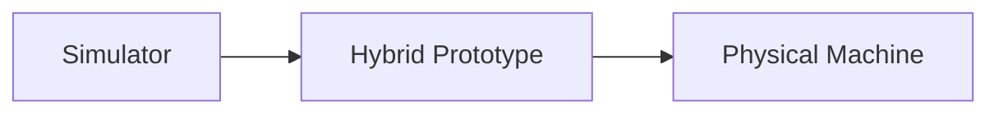

This allows a gradual transition between stages without rewriting the entire system.

### 2.1 Driven Conveyor vs. Gravity Conveyor

In addition to mechanically driven sections (motor-driven belt), the system should account from the start for the concept of **gravity conveyor** segments as an alternative or complementary way of transporting packages.

A gravity segment is a section of the route (roller or slide type) where a package moves without a motor, driven purely by incline and gravity, and slowed down by rolling/sliding friction.

**Why this should be included at the simulation stage:**

| Benefit | Description |
|---|---|
| Cost | Cheap buffer/accumulation zones without a motor |
| Use of geometry | Natural descents between levels, drops toward gates |
| Reliability | Fewer drives = fewer points of failure |
| Different physics | Variable, uncontrolled speed — direct impact on the positioning model and controller logic |

The core design principle stays the same: the controller and sorting logic should not need to know whether a given route segment is mechanically driven or gravity-based — they should operate on a shared "transport segment" abstraction (see section 4.1a).

## 3. Target Architecture

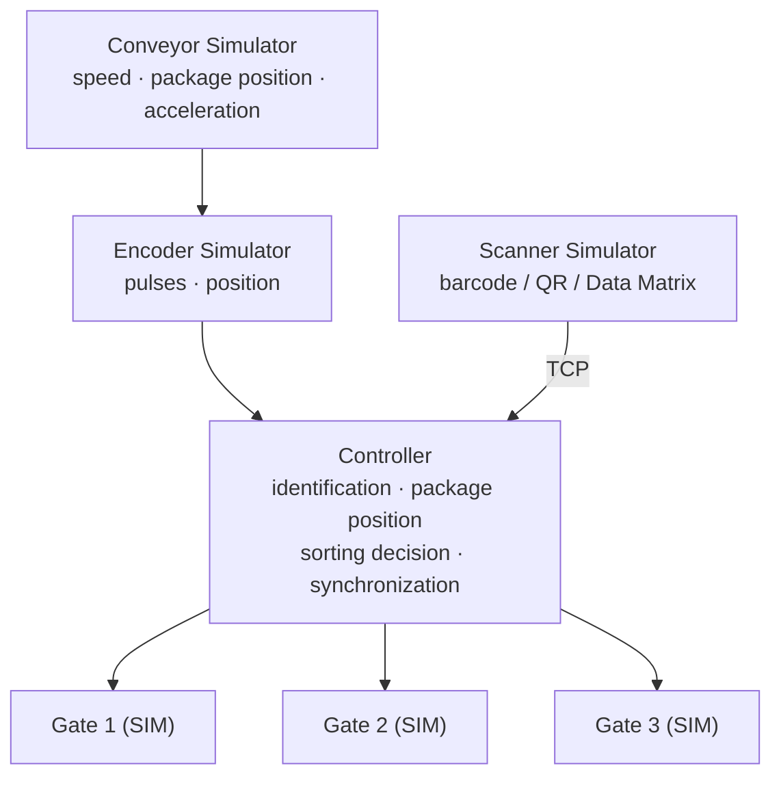

> **Note:** "Conveyor Simulator" here represents a generic transport segment — in practice, a package's route may consist of alternating driven segments (belt/roller conveyor) and gravity segments (gravity conveyor), joined into one logical transport chain (see section 4.1a).

## 4. System Components

### 4.1. Conveyor – belt simulator

Responsible for the virtual movement of packages. It should support:

- belt speed, acceleration, braking
- direction of travel, belt length
- package position and spacing between packages
- emergency stop
- speed changes during operation

| Parameter | Value |
|---|---|
| `conveyor_length` | 20.0 m |
| `speed` | 1.0 m/s |
| `max_speed` | 2.0 m/s |
| `acceleration` | 0.5 m/s² |

Each package has a position on the transport axis, e.g. `position = 4.35 m`.

### 4.1a. Gravity Conveyor – gravity segment simulator

A gravity segment is a distinct type of transport segment. It shares the same position/velocity interface as a driven segment, but follows different physics.

**Key difference:** on a gravity segment, package speed is *not set by the controller* — it results from a physical simulation (incline, package mass/resistance, friction). Speed may differ between packages (a lighter package decelerates faster than a heavier one).

| Parameter | Value | Description |
|---|---|---|
| `segment_type` | `"gravity"` | segment type |
| `length` | 3.0 m | segment length |
| `incline_angle` | 8.0° | incline angle (positive = downhill) |
| `friction_coefficient` | 0.04 | rolling/sliding friction |
| `roller_diameter` | 0.05 m | for the roller variant |
| `min_package_weight` | 0.2 kg | below this mass a package may not move at all |

Simplified acceleration model (for simulation purposes):

```
a = g · sin(incline_angle) − g · friction_coefficient · cos(incline_angle)
```

A negative `a` means the package will decelerate rather than accelerate on the given incline and friction combination.

**Edge cases to simulate:**

- a package stops before reaching the end of the segment (angle too small / friction too high / package too light)
- a package "catches up" with the one ahead (pile-up / accumulation)
- a jam at the exit of the gravity segment
- different exit speed depending on entry speed

**Consequences for the rest of the system:**

| Area | Consequence |
|---|---|
| Positioning | No drive encoder → position derived from a physical model + presence sensors along the segment |
| Speed control | The controller does not control speed directly; it may only act indirectly (e.g. via retarders/roller brakes) |
| EMERGENCY_STOP | No motor to disable — requires a mechanical stopper/latch (see section 26) |
| Interface | Shared `ConveyorSegment` interface with `DrivenConveyorSegment` and `GravityConveyorSegment` implementations |

## 5. Package – package model

Every package in the simulator should be an independent object.

```json
{
  "package_id": "PKG-000123",
  "barcode": "5901234567890",
  "position": 4.35,
  "velocity": 1.0,
  "destination": 3,
  "width": 0.25,
  "length": 0.40,
  "height": 0.20,
  "status": "IN_TRANSIT"
}
```

**Possible states:**

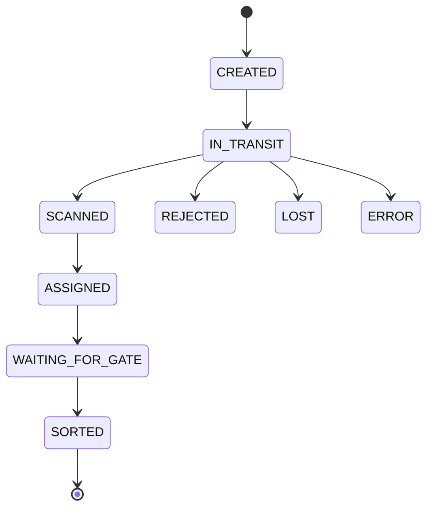

## 6. Scanner – barcode scanner simulator

The scanner simulator should behave like a real industrial device. A physical camera is not needed at this stage — the simulator generates code reads.

**Supported code types:** EAN-13, Code 128, Code 39, QR, Data Matrix.

```json
{
  "event": "CODE_DETECTED",
  "scan_id": "SCAN-000001",
  "package_id": "PKG-000123",
  "code": "5901234567890",
  "timestamp": "2026-08-12T10:00:00.123Z",
  "position": 4.35,
  "confidence": 0.98
}
```

## 7. Realistic Scanner Simulation

The simulator should be able to generate:

- a successful read
- no code found, unreadable code, incorrect code
- read delay
- duplicate reads of the same package
- packages positioned very close together
- variable read quality

```json
{
  "event": "CODE_NOT_FOUND",
  "package_id": "PKG-000124",
  "timestamp": "2026-08-12T10:00:01.523Z"
}
```

## 8. Scanner Communication

In the long run, the scanner should communicate with the control system over Ethernet. At the simulation stage, TCP/IP is recommended — the scanner can be simulated as a separate TCP process/application.

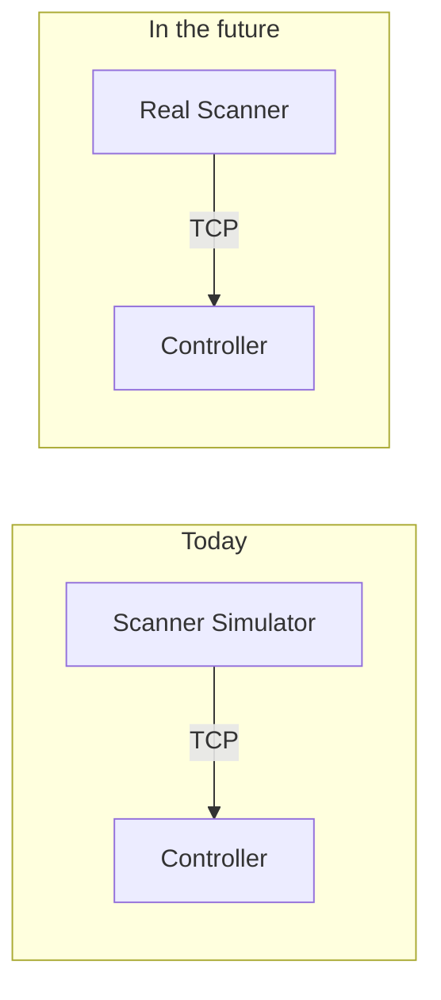

The controller should not require any changes between these two variants.

## 9. Encoder – encoder simulator

The encoder is used to determine the actual movement of the belt. The simulator should generate pulses in sync with the belt's motion.

| Parameter | Value |
|---|---|
| `encoder_resolution` | 1000 pulses/revolution |
| `wheel_circumference` | 0.5 m |

This allows the controller to determine package position based on pulses rather than time alone — especially important when belt speed changes.

> **Note:** on gravity segments (section 4.1a) there is no drive encoder — package position there must be derived by another method (physical model + presence sensors).

## 10. Sensor – sensor simulator

The system should support simulating:

- entry photoelectric sensor and scanner photoelectric sensor
- package presence sensor
- gate position sensor
- end-of-belt sensor
- package jam sensor

```json
{
  "event": "PACKAGE_DETECTED",
  "sensor_id": "SENSOR-01",
  "package_id": "PKG-000123",
  "position": 2.15
}
```

## 11. Gate – sorting gate simulator

Each gate has its own model:

```json
{
  "gate_id": 3,
  "state": "CLOSED",
  "open_time_ms": 300,
  "close_time_ms": 300
}
```

Reaction time to an `OPEN GATE 3` command:

| Time | State |
|---|---|
| 0 ms | OPENING |
| 150 ms | OPENING |
| 300 ms | OPEN |
| 600 ms | CLOSING |
| 900 ms | CLOSED |

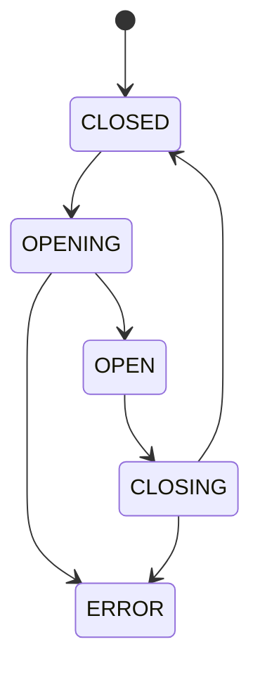

## 12. Controller

The controller is the most important element of the system. It is responsible for:

- receiving information from the scanner and tracking packages/positions
- assigning packages to gates
- calculating arrival time at the gate
- controlling gates
- error handling and exception handling
- synchronizing all components

Example decision flow for a single package:

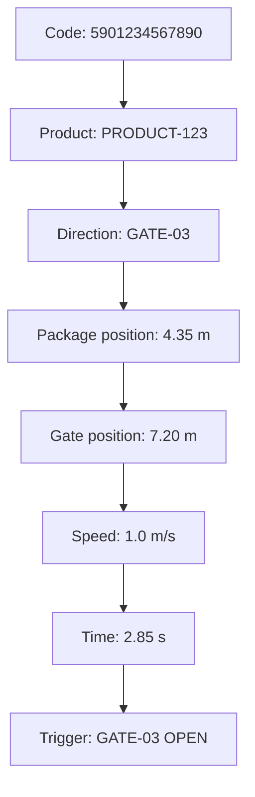

## 13. Sorting Algorithm

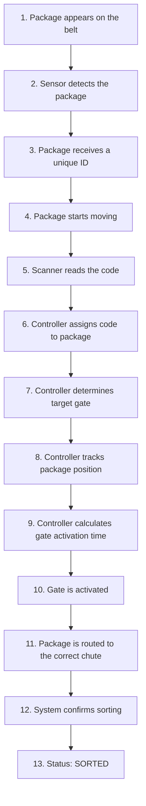

## 14. Package Positioning

The system should not rely solely on timers.

**Example:** package at 4.35 m, gate at 7.20 m → distance 2.85 m.

| Speed | Predicted arrival time |
|---|---|
| 1.0 m/s | 2.85 s |
| 1.5 m/s (after a change) | the system must recalculate |

The foundation should be an encoder-based positioning model.

> On gravity segments (section 4.1a), where there is no drive encoder, predicting arrival time is inherently less certain — the controller should rely there on a physical motion model and additional presence sensors, rather than solely on extrapolating the last known speed.

## 15. Hardware Interface

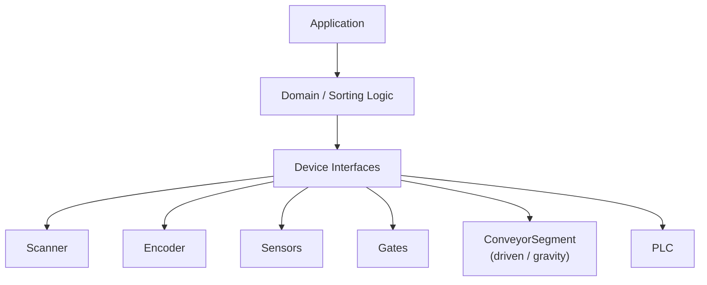

Every piece of hardware should have an interface:

```python
class Scanner:
    async def scan(self):
        raise NotImplementedError

class SimulatedScanner(Scanner):
    ...

class TcpScanner(Scanner):
    ...
```

Similarly for transport:

```python
class ConveyorSegment:
    async def get_package_position(self, package_id):
        raise NotImplementedError

class DrivenConveyorSegment(ConveyorSegment):
    ...

class GravityConveyorSegment(ConveyorSegment):
    ...
```

This means the controller doesn't need to know which device — or which segment type — the information came from.

## 16. Future PLC Communication

In the production version, device control may be handled by a PLC. Protocols under consideration: PROFINET, EtherNet/IP, Modbus TCP.

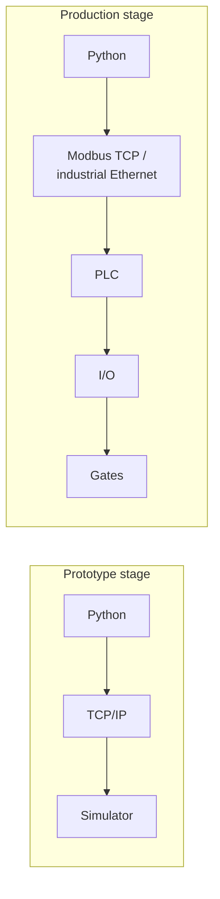

## 17. HMI

The system should have a visualization panel showing:

- current belt speed and package positions
- decoded codes
- active gates and sensor states
- encoder state
- errors
- number of sorted packages and errors
- current throughput
- the type of the currently active transport segment (driven / gravity)

```
┌─────────────────────────────────────────────┐
│             SORTER SIMULATOR                │
├─────────────────────────────────────────────┤
│ Speed: 1.20 m/s     Packages: 1245           │
│ Sorted: 1198        Errors: 12               │
├─────────────────────────────────────────────┤
│  📦──📦──📦──📦──📦──►         [SCAN]        │
├─────────────────────────────────────────────┤
│ G1: CLOSED   G2: OPEN    G3: CLOSED          │
│ G4: CLOSED   G5: ERROR   G6: CLOSED          │
└─────────────────────────────────────────────┘
```

## 18. Technology Stack

| Layer | Technology                                    |
|---|-----------------------------------------------|
| Backend | Python, FastAPI, Pydantic, asyncio, WebSocket |
| Database | PostgreSQL                                    |
| Frontend | NextJs                                        |
| Communication (current) | TCP/IP, WebSocket, REST API                   |
| Communication (future) | Modbus TCP, PROFINET, EtherNet/IP             |

The database may store: packages, codes, sorting results, gate configuration, events, errors, simulation history.

## 19. Project Structure

```
sorter-simulator/
├── backend/
│   ├── app/
│   │   ├── api/
│   │   ├── controllers/
│   │   ├── domain/
│   │   │   ├── package.py
│   │   │   ├── conveyor.py
│   │   │   ├── gravity_conveyor.py
│   │   │   ├── scanner.py
│   │   │   ├── encoder.py
│   │   │   ├── gate.py
│   │   │   └── sensor.py
│   │   ├── simulation/
│   │   │   ├── engine.py
│   │   │   ├── clock.py
│   │   │   └── scenarios.py
│   │   ├── devices/
│   │   │   ├── scanner/
│   │   │   ├── encoder/
│   │   │   ├── sensors/
│   │   │   └── gates/
│   │   └── main.py
│   └── tests/
├── frontend/
│   └── sorter-ui/
├── simulator/
│   ├── scanner_simulator/
│   ├── conveyor_simulator/
│   ├── gravity_conveyor_simulator/
│   ├── encoder_simulator/
│   └── gate_simulator/
├── docker/
├── docs/
└── README.md
```

## 20. Simulation Engine

The central element should be a `SimulationEngine`, responsible for synchronizing simulation time.

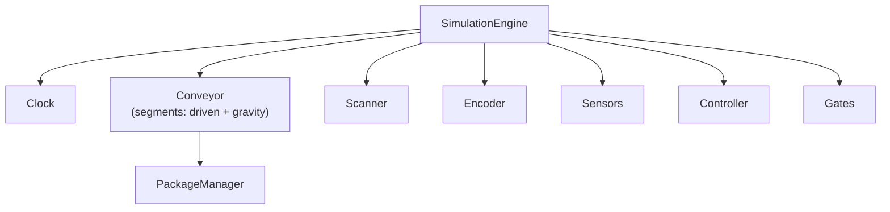

The engine should support `START`, `PAUSE`, `RESUME`, `STOP`, `RESET`, and `SPEED x1 / x2 / x10 / x100` — allowing thousands of cycles to be tested quickly.

## 21. Virtual Time

The simulator should distinguish between **REAL TIME** and **SIMULATION TIME**, e.g. 1 real second = 10 simulated seconds. This allows tests to run faster.

## 22. Test Scenarios

| Scenario | Parameters |
|---|---|
| Normal operation | 1000 packages, 1.0 m/s, 100% correct codes |
| High speed | 1000 packages, 2.0 m/s, minimal spacing |
| Scan errors | 5% unreadable codes, 2% incorrect codes |
| Variable speed | 0.5 → 1.0 → 1.5 → 0.8 m/s |
| Gate failure | GATE-03 = ERROR |
| Jammed package | Package does not leave the sorting zone |
| Gravity segment | A package with variable mass/resistance enters the gravity segment — verify it clears the segment as predicted, or stalls/piles up |

## 23. Testing

Key automated test cases:

- correct package identification, correct gate assignment
- correct position calculation, correct gate trigger
- no code found, unknown code, delayed scan
- speed change, gate failure
- belt stop and restart
- two packages very close together
- a package stalling on the gravity segment
- packages piling up on the gravity segment

## 24. Logging

Every significant event should be logged:

```
10:00:01.123 PACKAGE_CREATED   PKG-000123
10:00:01.450 SENSOR_DETECTED   PKG-000123
10:00:01.620 CODE_DETECTED     5901234567890
10:00:01.621 PACKAGE_ASSIGNED  GATE-03
10:00:04.250 GATE_OPEN         GATE-03
10:00:04.510 PACKAGE_SORTED    PKG-000123
10:00:04.800 GATE_CLOSED       GATE-03
```

This allows later analysis of synchronization issues.

## 25. Error Handling

The system should account for:

| Error code | Category |
|---|---|
| `UNKNOWN_BARCODE` | Scanning |
| `CODE_NOT_FOUND` | Scanning |
| `DUPLICATE_SCAN` | Scanning |
| `PACKAGE_LOST` | Package tracking |
| `GATE_ERROR` | Gate |
| `SENSOR_ERROR` | Sensor |
| `ENCODER_ERROR` | Encoder |
| `CONVEYOR_STOPPED` | Driven conveyor |
| `GRAVITY_SEGMENT_STALL` | Gravity segment |
| `GRAVITY_SEGMENT_JAM` | Gravity segment |
| `COMMUNICATION_ERROR` | Communication |
| `TIMEOUT` | Communication |

Each error should include: code, timestamp, component, description, severity level, and package ID (if applicable).

## 26. Safety

`EMERGENCY_STOP` should cause:

| Component | Reaction |
|---|---|
| Conveyor (driven) | STOP |
| Conveyor (gravity) | Mechanical stopper activated |
| Gates | SAFE_STATE |
| Scanner | STOP / IDLE |
| Controller | SAFE_MODE |

Because a gravity segment has no motor to disable, its "stop" must be modeled as a separate mechanism (e.g. an extendable latch/stopper), logically independent from stopping the belt motor.

In the physical version, safety functions should be implemented independently of the software application, in accordance with machinery safety requirements.

## 27. Migration from Simulator to Hardware

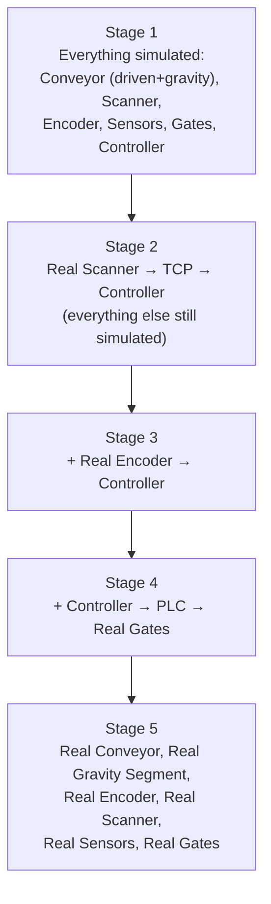

The controller and sorting logic remain as unchanged as possible at every stage.

## 28. Key Design Principle

Avoid writing `if scanner_is_simulated: ... else: ...` logic throughout the application. Instead, use abstractions:

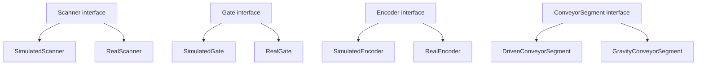

This is essential for the later integration with the physical machine.

## 29. First MVP Version

The MVP should include:

1. Conveyor (driven segment)
2. Package
3. Scanner Simulator
4. Encoder Simulator
5. Controller
6. 3-5 Simulated Gates
7. Basic sorting algorithm
8. REST API
9. WebSocket
10. Simple HMI panel
11. Event logging
12. Automated tests

The gravity segment doesn't need to be part of the MVP itself, but the `ConveyorSegment` interface should be designed from the start so it can be added without reworking the controller (see sections 4.1a and 28).

**Minimal scenario:**

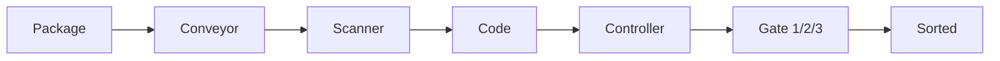

## 30. Example API

| Endpoint | Method | Body |
|---|---|---|
| `/api/packages` | `POST` | `{"barcode": "5901234567890"}` |
| `/api/simulation/status` | `GET` | — |
| `/api/simulation/start` | `POST` | — |
| `/api/simulation/stop` | `POST` | — |
| `/api/simulation/reset` | `POST` | — |
| `/api/conveyor/speed` | `POST` | `{"speed": 1.2}` |

## 31. WebSocket

The frontend should receive the current machine state via WebSocket:

```json
{
  "type": "simulation_state",
  "timestamp": 1786521542.123,
  "conveyor": { "speed": 1.2 },
  "packages": [
    { "id": "PKG-001", "position": 4.2, "gate": 3 }
  ],
  "gates": [
    { "id": 1, "state": "CLOSED" },
    { "id": 2, "state": "OPEN" },
    { "id": 3, "state": "CLOSED" }
  ]
}
```

## 32. Machine Configuration

```yaml
conveyor:
  length: 20.0
  speed: 1.0
  max_speed: 2.0

encoder:
  pulses_per_meter: 2000

scanner:
  detection_delay_ms: 50
  error_rate: 0.02

gravity_segments:
  - id: 1
    position_start: 12.0
    length: 3.0
    incline_angle: 8.0
    friction_coefficient: 0.04
    roller_diameter: 0.05

gates:
  - id: 1
    position: 7.0
    opening_time_ms: 300
    closing_time_ms: 300
  - id: 2
    position: 9.0
    opening_time_ms: 300
    closing_time_ms: 300
  - id: 3
    position: 11.0
    opening_time_ms: 300
    closing_time_ms: 300
```

## 33. Performance

The system should be prepared for a high volume of events:

| Parameter | Range |
|---|---|
| Belt speed | 0.5–2.0 m/s |
| Packages | 1–10 pkg/s |
| Number of gates | 3–50 |
| Packages per simulation run | 100,000+ |

The simulator should support running long-duration tests.

## 34. Statistics

The system should compute: `total_packages`, `sorted_packages`, `rejected_packages`, `unknown_codes`, `scan_errors`, `gate_errors`, `gravity_segment_stalls`, `average_scan_time`, `average_sort_time`, `throughput`, `packages_per_second`.

```
TOTAL:        10 000
SORTED:        9 820
REJECTED:        120
ERRORS:           60

THROUGHPUT:    4.2 pkg/s
SUCCESS RATE: 98.2%
```

## 35. Target Hardware Architecture

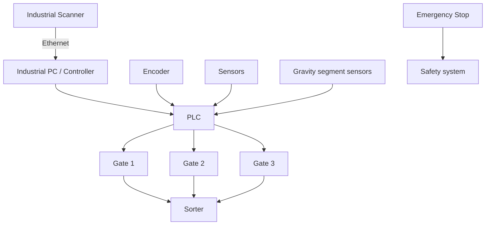

## 36. Development Strategy

| Phase | Scope |
|---|---|
| 1 – Domain model | Package, Conveyor (driven), Gravity Conveyor Segment, Gate, Scanner, Encoder, Sensor |
| 2 – Simulation engine | virtual time, motion, positioning (including the gravity segment's physical model), events |
| 3 – Controller | identification, package tracking, routing, gate control |
| 4 – Communication | TCP, REST, WebSocket |
| 5 – HMI | machine visualization, statistics, configuration |
| 6 – Testing | scenarios, load, failures, synchronization |
| 7 – Hardware integration | real scanner, encoder, PLC, I/O, gates, belt / gravity segments |

## 37. Success Criteria

The simulator project can be considered ready to begin hardware integration if:

- [ ] 10,000+ packages can be simulated without critical errors
- [ ] packages are correctly tracked
- [ ] speed changes do not cause loss of synchronization
- [ ] the scanner is replaceable without changes to the sorting logic
- [ ] the gate is replaceable without changes to the controller
- [ ] the encoder is replaceable without changes to the sorting algorithm
- [ ] the gravity segment can be added/removed without changes to the controller logic
- [ ] failures are correctly handled
- [ ] all key events are logged
- [ ] the system has automated tests
- [ ] the simulation can run at accelerated speed
- [ ] the HMI shows the machine state in real time

## 38. Key Architectural Decisions

1. The simulator should mirror the real machine, not just generate random data.
2. Every device should have an abstract interface.
3. The scanner does not directly control the gate.
4. The controller makes the sorting decision.
5. Positioning should be based on the encoder — and where there is no encoder (gravity segments), on a physical model and presence sensors.
6. TCP/IP can be used as a simple interface for the simulated scanner.
7. Eventually, automation communication can be moved to PLC and industrial Ethernet.
8. Business logic must not depend on specific hardware or on the type of transport segment (driven/gravity).
9. The simulator should be able to generate failures and unusual situations, including ones specific to gravity segments (stalling, piling up).
10. The system should be developed from the start with future physical integration in mind.

## 39. Summary

This project will be the digital counterpart of the future sorting machine. Initially, all elements will be software-based:

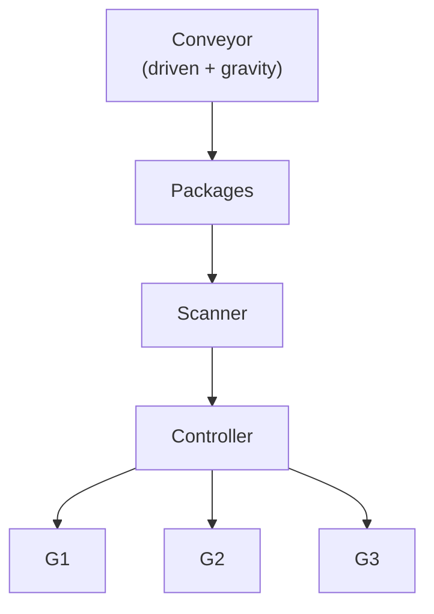

Individual elements will then be progressively replaced with physical hardware. The key architectural goal is to keep identical interfaces between the simulator and the hardware — this also applies to gravity segments, which should look like any other transport segment from the controller's point of view.

This allows the project to grow from a low-cost software environment into a real industrial machine without needing to rebuild the core system logic.
